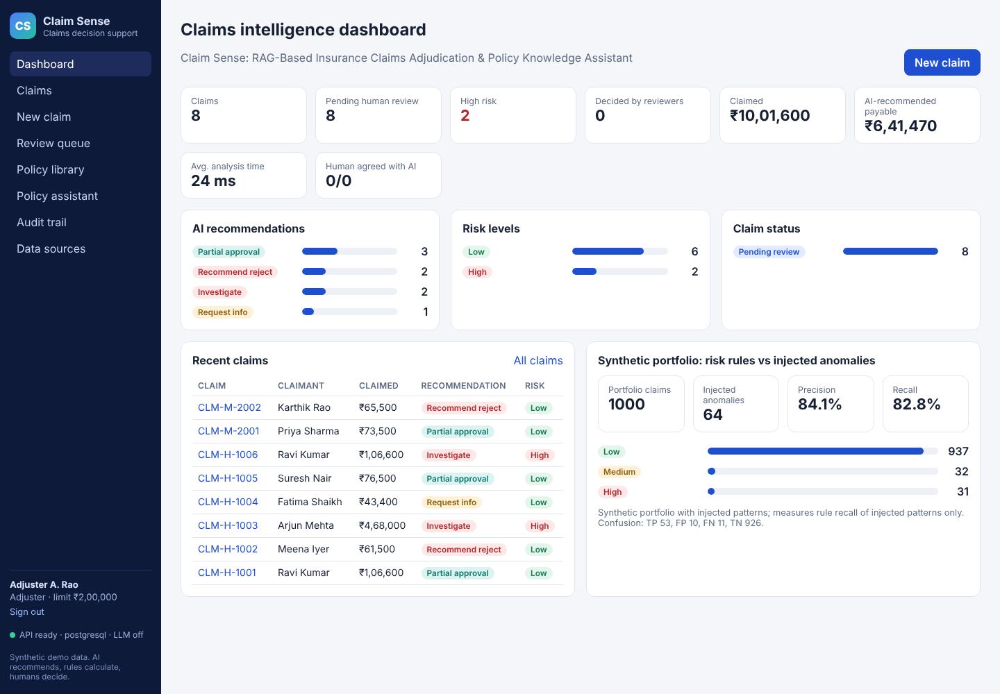
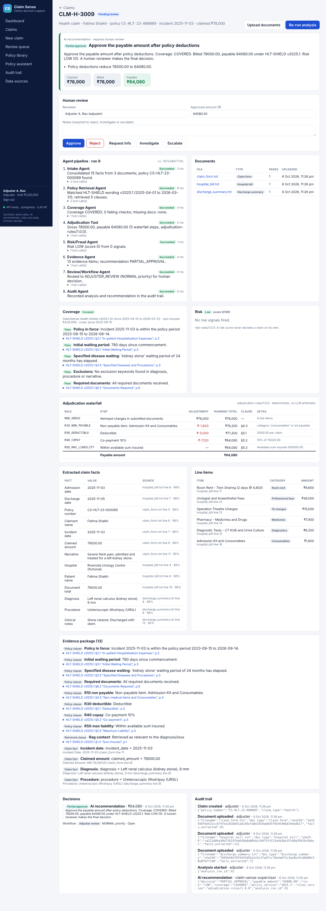
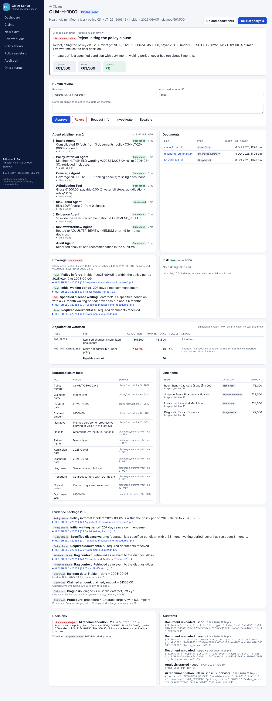
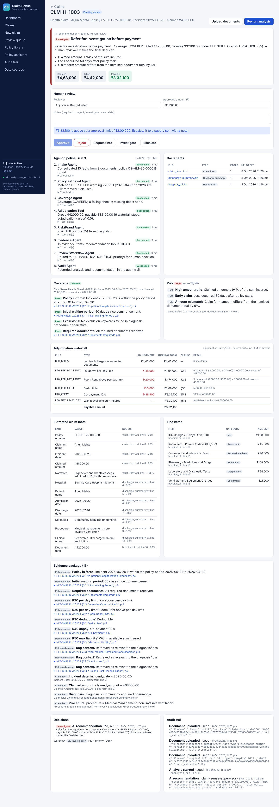
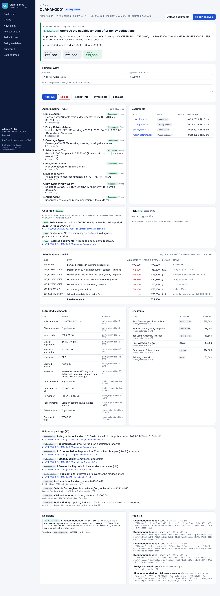
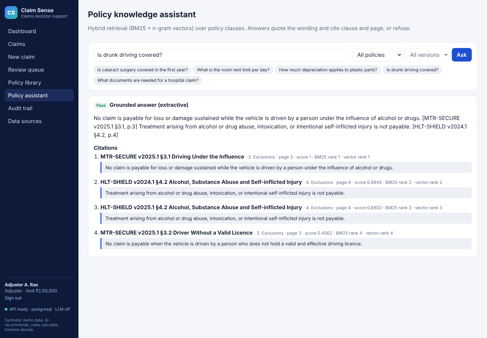
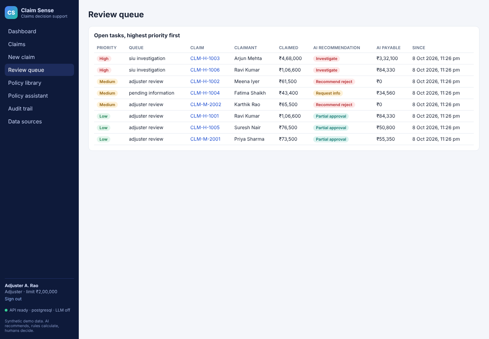
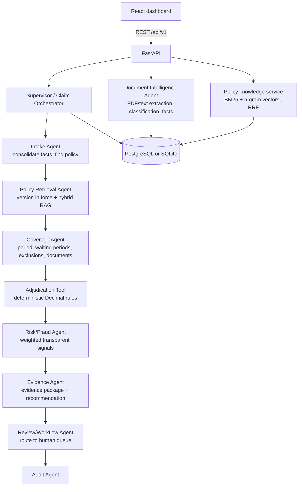

# Claim Sense: "RAG-Based Insurance Claims Adjudication & Policy Knowledge Assistant"

**Claim Sense — AI-Powered Insurance Claims Intelligence, Adjudication & Policy Decision-Support Platform**

> AI recommends. Evidence supports. Rules calculate. Humans decide. Workflows execute. Audit trails record.

Claim Sense takes a health or motor claim from intake to a human decision. It reads the claim documents, matches the policy wording that was in force on the incident date, retrieves the relevant clauses with page and clause citations, checks coverage and exclusions, calculates the payable amount with deterministic rules, raises risk and fraud signals, and hands an evidence-backed recommendation to a human reviewer. Every step is recorded in an audit trail.

All policies, people and claims in this repository are **synthetic**. See [Data](#data-and-datasets).



## What works today

| Area | What you can do | Where |
|---|---|---|
| Sign-in and roles | Adjuster (approves up to ₹2,00,000), Supervisor (no limit, decides escalations, ingests policies), Auditor (read-only); signed tokens; every action audited under the signed-in user | `/` |
| Dashboard | Live claim counts, recommendations, risk mix, review progress, portfolio evaluation | `/` |
| Claim intake | Create a claim, upload PDF or text documents, run the agent pipeline | `/claims/new` |
| Document intelligence | Document classification, extracted facts with source file, line and confidence, itemised charges | claim page |
| Policy versioning | Picks the wording version in force on the incident date (HLT-SHIELD 2024.1 vs 2025.1) | claim page |
| Hybrid RAG | BM25 + character n-gram vectors fused with reciprocal rank fusion; clause, section and page citations; refuses when evidence is weak | `/assistant` |
| Coverage | Policy period, initial and specified-disease waiting periods, exclusions, required documents, each citing its clause | claim page |
| Adjudication | Decimal rules engine: non-payable items, per-day limits, depreciation, deductible, co-pay, sum-insured cap, shown as a waterfall | claim page |
| Risk / fraud | Transparent weighted signals: amount ratio, early claim, frequency, duplicates, amount and name mismatches, missing documents | claim page |
| Recommendation | Approve, partial approval, reject, request info or investigate, with reasons and an evidence package | claim page |
| Human review | Approve (with amount override), reject, request info, investigate, escalate; notes required for adverse actions; approval limits enforced; escalated claims need a supervisor | claim page, `/reviews` |
| Workflow | Routing to adjuster, investigation (SIU), pending-information and supervisor queues | `/reviews` |
| Audit | Append-only events with actor, details and correlation IDs | `/audit` |
| Policy library | Browse clauses by version, view structured terms, ingest new wordings | `/policies` |
| Provenance | Which datasets are used and which public 2024–2026 sources are registered | `/datasets` |

## Real results from the golden scenarios

These are the outputs the running system produces for the eight seeded claims (no hand-edited numbers; `backend/tests/test_golden_path.py` asserts them).

| Claim | Scenario | Wording | Claimed | Payable | Coverage | Risk | Recommendation |
|---|---|---|---:|---:|---|---|---|
| CLM-H-1001 | Appendicectomy with room-rent cap, consumables, deductible, co-pay | HLT-SHIELD v2025.1 | ₹1,06,600 | ₹84,330 | Covered | Low | Partial approval |
| CLM-H-1002 | Cataract 6 months into a 24-month specified-disease wait | HLT-SHIELD v2025.1 | ₹61,500 | ₹0 | Not covered (§3.3) | Low | Reject |
| CLM-H-1003 | ICU pneumonia, 50 days after start, 94% of sum insured, form ≠ bill | HLT-SHIELD v2025.1 | ₹4,68,000 | ₹3,32,100 | Covered | High (75) | Investigate |
| CLM-H-1004 | Dengue, discharge summary missing | HLT-SHIELD v2025.1 | ₹43,400 | ₹34,560 | Covered | Low | Request info |
| CLM-H-1005 | Fracture in Feb 2025, so the 2024.1 wording applies | HLT-SHIELD v2024.1 | ₹76,500 | ₹50,800 | Covered | Low | Partial approval |
| CLM-H-1006 | Resubmission of CLM-H-1001 | HLT-SHIELD v2025.1 | ₹1,06,600 | ₹84,330 | Covered | High (50) | Investigate |
| CLM-M-2001 | Rear-end collision, 34-month-old car | MTR-SECURE v2025.1 | ₹73,500 | ₹55,350 | Covered | Low | Partial approval |
| CLM-M-2002 | Breath analyser positive | MTR-SECURE v2025.1 | ₹65,500 | ₹0 | Not covered (§3.1) | Low | Reject |

CLM-H-1001 waterfall, as the app shows it:

| Rule | Step | Adjustment | Running total | Clause |
|---|---|---:|---:|---|
| R00_GROSS | Itemised charges | ₹1,06,600 | ₹1,06,600 | |
| R20_PER_DAY_LIMIT | Room rent: 3 days × min(6,500, 5,000) | −₹4,500 | ₹1,02,100 | §2.2 |
| R10_NON_PAYABLE | Consumables (gloves, masks, kit) | −₹3,400 | ₹98,700 | §4.3 |
| R30_DEDUCTIBLE | Deductible | −₹5,000 | ₹93,700 | §5.1 |
| R40_COPAY | Co-payment 10% | −₹9,370 | ₹84,330 | §5.2 |
| R50_MAX_LIABILITY | Within sum insured ₹5,00,000 | — | **₹84,330** | §5.3 |

**Synthetic portfolio check.** The same risk rules scored a 1,000-claim synthetic portfolio with 64 injected anomalies: precision 84.1%, recall 82.8% (TP 53, FP 10, FN 11, TN 926). This only shows the rules recover patterns we injected ourselves; it says nothing about real-world fraud detection.

| | |
|---|---|
|  |  |
|  |  |
|  |  |

## Architecture



- One FastAPI modular monolith; agents are bounded modules with explicit tools, and each run persists agent runs, tool calls, timings and a correlation ID.
- The LLM is optional and never computes money or decides claims. Without `ANTHROPIC_API_KEY`, the assistant answers by quoting the wording it retrieved.
- Agent failures stop the run safely and route the claim to `NEEDS_ATTENTION`. Re-running analysis supersedes the previous recommendation and task.

More detail: [docs/ARCHITECTURE.md](docs/ARCHITECTURE.md), [docs/DECISIONS.md](docs/DECISIONS.md).

## Run it

### Docker (app + PostgreSQL)

```bash
docker compose up --build
# open http://localhost:8080
python3 scripts/smoke_test.py http://localhost:8080   # golden-path smoke test (signs in as supervisor)
```

### Local development

```bash
# backend (Python 3.11+)
cd backend
python -m venv .venv && . .venv/bin/activate
pip install -r requirements-dev.txt
uvicorn app.main:app --reload --port 8000      # seeds synthetic data on first start

# frontend (Node 20+), in another terminal
cd frontend
npm install
npm run dev                                      # http://localhost:5173, proxies /api to :8000
```

Configuration lives in environment variables; see [.env.example](.env.example). API docs are served at `/docs`.

### Demo accounts

All accounts are synthetic. The password is `DEMO_PASSWORD` (default `claimsense-demo`); set `AUTH_SECRET` to a long random value in any shared deployment.

| Username | Role | Can do |
|---|---|---|
| `adjuster` | Adjuster | Create and analyse claims, decide up to ₹2,00,000, escalate above that |
| `supervisor` | Supervisor | Everything, no limit, decide escalated claims, ingest policy wordings |
| `auditor` | Auditor | Read-only |

### Try the golden path

1. Sign in as `adjuster`, open **New claim**, pick policy `CS-HLT-23-000089` (Fatima Shaikh).
2. Upload the three files in [`data/claims/demo_upload/`](data/claims/demo_upload) and press **Create, upload and analyse**.
3. Review the recommendation, coverage checks, waterfall (₹78,000 billed, ₹64,080 payable), risk and evidence.
4. Approve it. The claim, review queue, dashboard and audit trail all update.

## Tests and checks

```bash
cd backend && ruff check app tests && python -m pytest -q    # 42 tests
cd frontend && npm run build                                 # type check + production build
```

Tests cover sign-in, roles, approval limits and escalation, security headers and upload path handling, the rules engine (hand-calculated waterfalls, rounding, caps, depreciation bands), the clause parser and retriever, extraction from text and PDF, risk levels, all eight golden scenarios, the full create → upload → analyse → review API flow, safe failure, upload validation and policy-ingestion validation. CI runs these plus `pip-audit`, `npm audit` and a Docker + PostgreSQL smoke test ([.github/workflows/ci.yml](.github/workflows/ci.yml)). Security controls and known gaps: [docs/SECURITY.md](docs/SECURITY.md).

## Data and datasets

| Data | Status |
|---|---|
| Synthetic policy wordings: HLT-SHIELD 2024.1 and 2025.1, MTR-SECURE 2025.1, each with structured terms that cite clauses | In use |
| Eight synthetic golden claim packets (claim forms, bills, estimates, discharge summaries, police reports; one as PDF) | In use |
| 1,000-claim synthetic portfolio with labelled injected anomaly patterns | In use for analytics and rule evaluation |
| IRDAI 2024 master circulars and statistics handbook, APRA NCPD 2026, CMS TiC PUF PY2026, Figshare 2025 and Zenodo 2024 claims datasets | Registered with purpose and URL; not downloaded in this build |

Everything is regenerated deterministically with `python data/synthetic/generate.py`. The wording borrows common Indian retail-insurance concepts but is not any insurer's product and not regulatory text. Never commit real customer data or confidential policy documents.

## Deployment

- **Docker**: one image serves the UI and the API (`Dockerfile`); `docker-compose.yml` adds PostgreSQL.
- **Azure Container Apps**: manual workflow [.github/workflows/deploy-azure.yml](.github/workflows/deploy-azure.yml) builds, deploys and runs the smoke test. Needs Azure credentials in repository secrets.
- **Render**: [render.yaml](render.yaml) blueprint for a one-click demo deployment.

The cloud deployment has **not** been run yet. No cloud credentials were available while building. See [docs/DEPLOYMENT.md](docs/DEPLOYMENT.md).

## Repository layout

```text
backend/app/
  agents/        supervisor + intake, document, policy, coverage, adjudicator, risk, evidence, review, audit
  adjudication/  deterministic rules engine
  rag/           clause parser, hybrid retriever, grounded answers
  api/routes.py  REST API v1
backend/tests/   pytest suite
frontend/src/    React + TypeScript UI (pages/, components/, api.ts)
data/            synthetic policies, claim packets, portfolio, dataset register, generator
docs/            blueprint, status, architecture, decisions, deployment, screenshots
references/      supporting planning documents
scripts/         smoke_test.py
```

## Roadmap

Single sign-on (Azure AD / OIDC) and user management, OCR for scanned images, embedding retriever as a third ranker, ingestion of the registered IRDAI circulars into the RAG corpus, ML fraud model on the Figshare dataset, property and travel lines, background job queue, Azure AI Search, Key Vault and Application Insights. Status and next actions: [docs/IMPLEMENTATION_STATUS.md](docs/IMPLEMENTATION_STATUS.md).

## Disclaimer

Claim Sense is decision support. Recommendations always require a human decision, and outputs from this demo must not be used for real claims.
